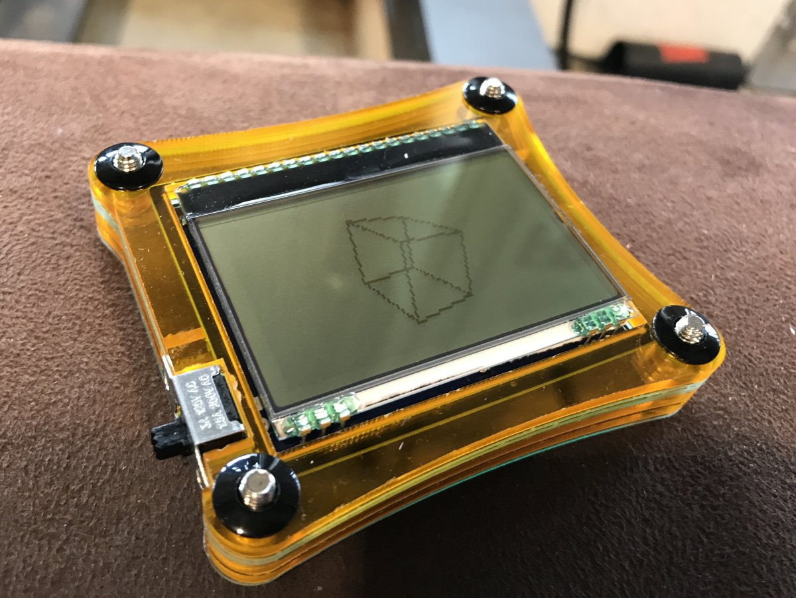
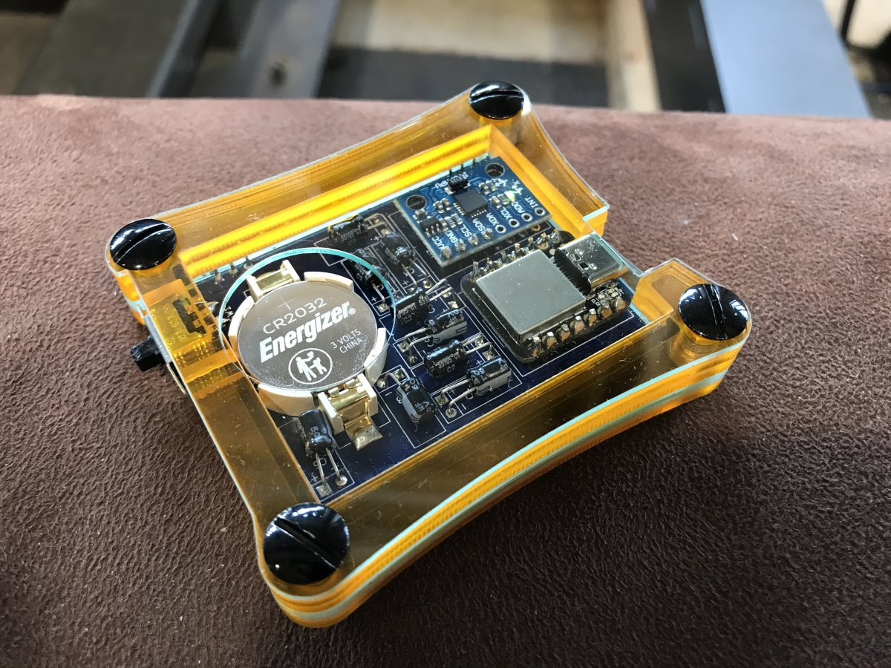

# Dot-Dot-Tilt!

_Matrix display meets motion sensor for fun inertial games_

This repository contains the source code, schematic, PCB and other design files for Dot-Dot-Tilt!, a small motion-controlled device for inertial simulations and games.

Check out the project's Hackaday page at [hackaday.io/project/186687-dot-dot-tilt](https://hackaday.io/project/186687-dot-dot-tilt), or the short video showing it [in action](https://youtu.be/RH-mNLPE31o).

Here's what it looks like from the front, showing a 3D cube that rotates in reaction to tilting:

And here's the back view, with the electronics inside:

## Building the code

In order to build the C++ source code you need VS Code with the PlatformIO plugin installed. The code here targets the SAMD21 microcontroller, and specifically, the Seeeduino XIAO board.

## License

Everything in this repository, with the exception of the files under `code/lib`, are (C) Gabor L Ugray. All code is released under the MIT license, and all other content is released under Creative Commons CC-BY-SA-NC. The files under `code/lib` are included under their respective licenses, as specified in the source files.